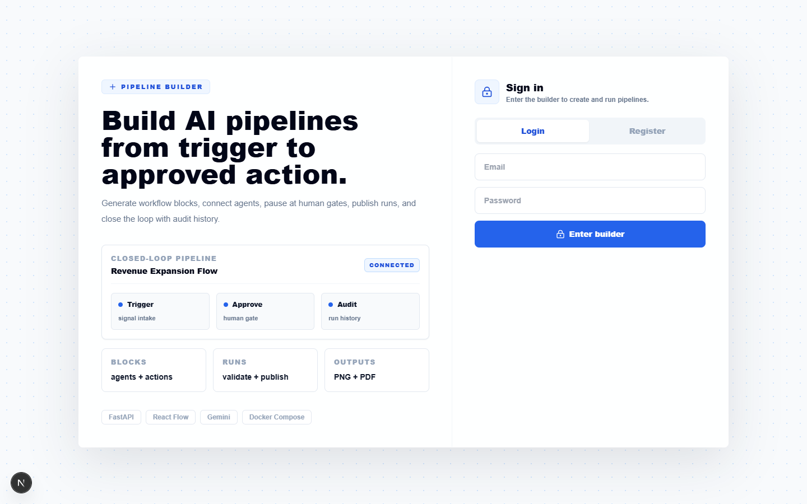
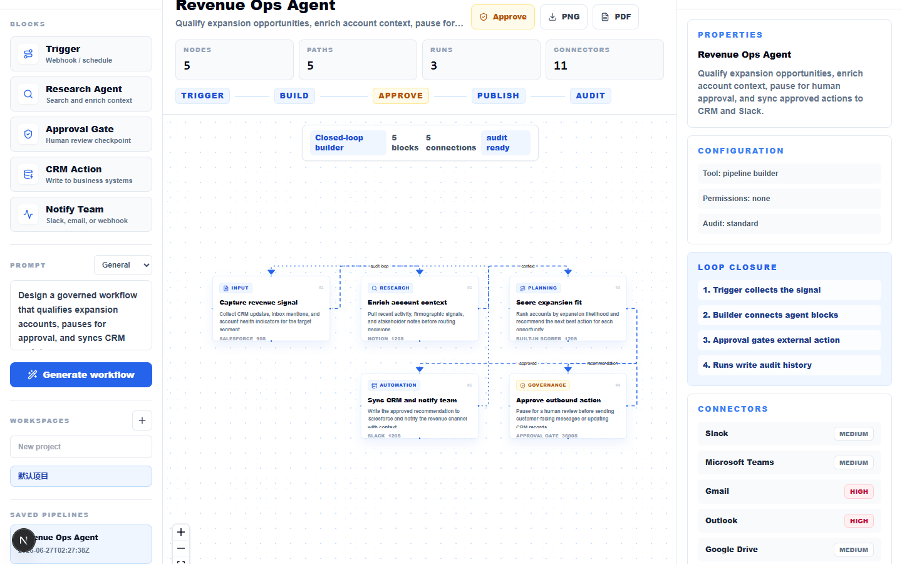
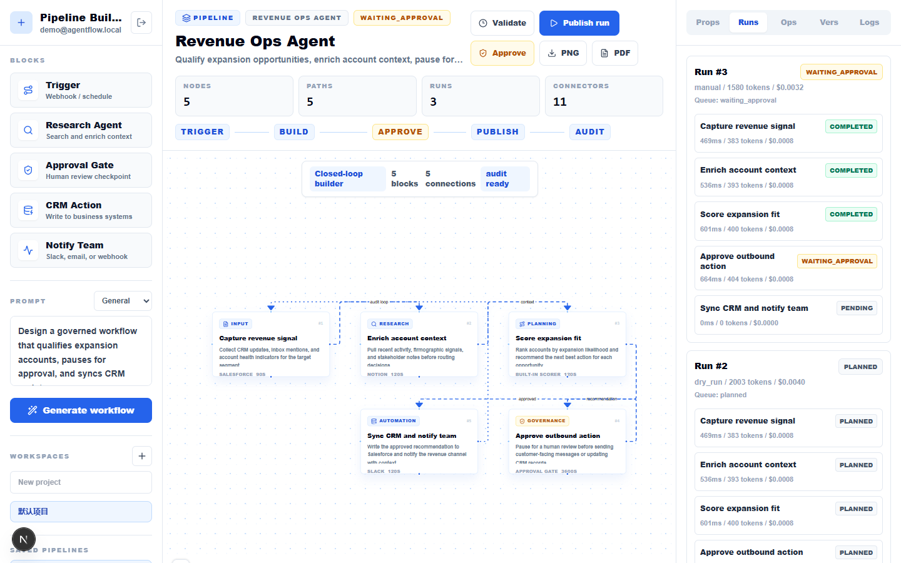

# AgentFlow Studio Enterprise

AgentFlow Studio is a Gemini-powered agent workflow orchestration studio. The backend AgentFlow Orchestrator turns a user goal into structured nodes and dependency edges, while the Next.js frontend renders an editable React Flow workspace for running, approving, observing, and exporting workflows.

It is designed as a portfolio-ready enterprise AI workflow platform: authentication, project workspaces, templates, canvas persistence, version history, PNG/PDF export, request logs, rate limits, Gemini retry handling, governance events, connector catalog, workflow runs, step status, human approval gates, RBAC membership, queue state, connector invocation audit, observability summary, and CI.

## Screenshots

| Login | Workflow Canvas | Run History and Export |
| --- | --- | --- |
|  |  |  |

## Highlights

- **Prompt-to-DAG generation**: FastAPI calls Gemini and validates structured topology output with Pydantic.
- **Interactive canvas**: React Flow renders agent nodes, typed edges, templates, versions, exports, and node inspection.
- **Executable workflow engine**: `POST /api/canvases/{canvas_id}/runs` executes nodes in DAG order and persists run/step records.
- **Human approval gate**: Governance, Decision, approval, or human nodes pause execution; approval resumes downstream pending steps.
- **Connector catalog and audit**: Slack, Teams, Gmail, Outlook, Google Drive, Jira, GitHub, Notion, Salesforce, PostgreSQL, and Webhook/HTTP Request are modeled with invocation audit records.
- **Enterprise control plane**: health, readiness checks, governance events, request logs, rate limits, RBAC membership, queue state, and observability summary.
- **Open-source friendly setup**: Docker Compose starts frontend and backend together without machine-specific paths.

## Tech Stack

| Layer | Technology |
| --- | --- |
| Frontend | Next.js 16, React 19, Tailwind CSS, React Flow, Lucide React |
| Backend | FastAPI, Pydantic, SQLite, Google GenAI SDK, Gemini |
| Storage | SQLite reference database at `canvas-backend/data/agentflow.db` |
| CI | GitHub Actions for backend tests and frontend build |

## Quick Start with Docker Compose

1. Create a backend env file:

```bash
cp canvas-backend/.env.example canvas-backend/.env
```

2. Edit `canvas-backend/.env` and set `GEMINI_API_KEY` if you want live DAG generation. The rest of the app works without a Gemini key.

3. Start both services:

```bash
docker compose up --build
```

4. Open:

```text
http://localhost:3000
```

Backend health check:

```text
http://localhost:8000/api/health
```

## Local Development

### Backend

```bash
cd canvas-backend
python -m venv .venv
source .venv/bin/activate
pip install -r requirements.txt
cp .env.example .env
python -m uvicorn main:app --host 127.0.0.1 --port 8000 --reload
```

PowerShell activation on Windows:

```powershell
.\.venv\Scripts\Activate.ps1
```

### Frontend

```bash
cd canvas-frontend
npm install
npm run dev
```

Open:

```text
http://localhost:3000
```

## Environment Variables

Backend variables live in `canvas-backend/.env`:

```env
GEMINI_API_KEY=your_gemini_api_key
GEMINI_MODEL=gemini-2.5-flash
APP_SECRET=change-me-to-a-long-random-secret
TOKEN_TTL_SECONDS=604800
RATE_LIMIT_PER_MINUTE=90
GEMINI_MAX_RETRIES=3
ENTERPRISE_MODE=false
CONNECTOR_EXECUTION_ENABLED=false
```

Frontend variable:

```env
NEXT_PUBLIC_API_BASE_URL=http://localhost:8000
```

## Deployment Guide

### Option A: Vercel + Render

1. Deploy `canvas-backend` to Render as a Python web service.
2. Set the Render start command:

```bash
python -m uvicorn main:app --host 0.0.0.0 --port $PORT
```

3. Add backend environment variables in Render.
4. Deploy `canvas-frontend` to Vercel.
5. Set `NEXT_PUBLIC_API_BASE_URL` in Vercel to the Render backend URL.
6. Add the deployed frontend origin to your production CORS policy before public launch.

### Option B: Railway

1. Create two Railway services from the same repository.
2. Set service roots to `canvas-backend` and `canvas-frontend`.
3. Backend start command:

```bash
python -m uvicorn main:app --host 0.0.0.0 --port $PORT
```

4. Frontend build/start:

```bash
npm ci
npm run build
npm run start -- --hostname 0.0.0.0 --port $PORT
```

5. Set `NEXT_PUBLIC_API_BASE_URL` to the backend public URL.

### Option C: Single VM with Docker Compose

1. Copy the repository to the server.
2. Create `canvas-backend/.env`.
3. Run:

```bash
docker compose up --build -d
```

4. Put a reverse proxy such as Nginx or Caddy in front of ports `3000` and `8000`.

## Main API

| Method | Path | Description |
| --- | --- | --- |
| `GET` | `/api/health` | Runtime health check |
| `GET` | `/api/readiness` | Enterprise readiness checks |
| `POST` | `/api/auth/register` | Register account |
| `POST` | `/api/auth/login` | Login and receive token |
| `GET` | `/api/projects` | List accessible projects |
| `POST` | `/api/projects` | Create project |
| `GET` | `/api/projects/{project_id}/members` | List project RBAC members |
| `GET` | `/api/projects/{project_id}/canvases` | List project canvases |
| `POST` | `/api/generate-canvas` | Generate and save workflow canvas |
| `GET` | `/api/canvases/{canvas_id}/versions` | Version history |
| `GET` | `/api/connectors` | Enterprise connector catalog |
| `POST` | `/api/canvases/{canvas_id}/runs` | Start workflow run or dry run |
| `GET` | `/api/canvases/{canvas_id}/runs` | Canvas run history |
| `GET` | `/api/runs/{run_id}` | Run with node-level steps |
| `GET` | `/api/runs/{run_id}/connector-invocations` | Connector invocation audit |
| `POST` | `/api/runs/{run_id}/steps/{step_id}/approve` | Approve or reject human gate |
| `GET` | `/api/observability/summary` | Ops dashboard summary |
| `GET` | `/api/logs` | Request logs |
| `GET` | `/api/governance/events` | Governance events |

Business APIs require:

```text
Authorization: Bearer <token>
```

## Verification

Backend:

```bash
cd canvas-backend
python -m py_compile main.py schemas.py
python -m unittest discover -s tests
```

Frontend:

```bash
cd canvas-frontend
npm run build
```

CI:

```text
.github/workflows/ci.yml
```

Current tests cover account registration/login, projects, RBAC membership, templates, request logs, governance events, canvas persistence, version history, owner isolation, topology JSON parsing, connector catalog, workflow run, queue status, connector invocation audit, observability summary, and approval continuation.
